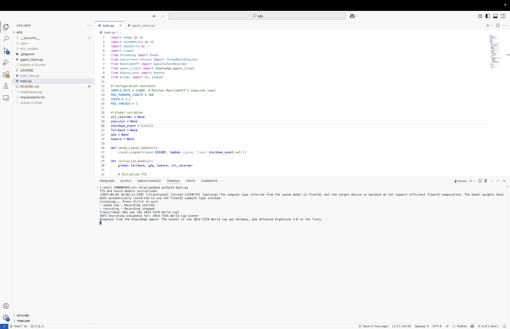

# Real-Time Speech-to-Speech Chatbot 🤖

A cutting-edge voice assistant combining state-of-the-art speech recognition, AI reasoning, and neural text-to-speech capabilities. Built with real-time interaction in mind ( LLM tool calls)

## Features ✨

- 🎙️ Real-time speech recognition using Whisper + Silero VAD
- 🤖 Multimodal reasoning with Llama 3.1 8B through Agno agent
- 🌐 Web integration (Google Search, Wikipedia, Arxiv)
- 🗣️ Natural voice synthesis with Kokoro-82M ONNX
- ⚡ Low-latency audio processing pipeline
- 🔧 Extensible tool system for agent capabilities

## Tech Stack 🛠️

| Component              | Technology                          |
|------------------------|-------------------------------------|
| Speech-to-Text         | Whisper (large-v1) + Silero VAD     |
| Language Model         | Llama 3.1 8B via Ollama             |
| Text-to-Speech         | Kokoro-82M ONNX                     |
| Agent Framework        | Agno LLM Agent                      |


## Installation 📦

### Prerequisites
- Python 3.9+
- [Ollama](https://ollama.com/) running locally

### Install Ollama
#### On Mac:
Download and install Ollama from [Ollama Mac download page](https://ollama.com/download/mac).

#### On Linux:
Run the following command in your terminal:
```bash
curl -fsSL https://ollama.com/install.sh | sh
```

```bash
# Clone repository
git clone https://github.com/tarun7r/Vocal-Agent.git

# Install Python dependencies
pip install -r requirements.txt

# Install system dependencies for linux
sudo apt-get install espeak-ng

# For Mac users use brew to install 
brew install espeak-ng
```

## Models Setup 🧠

### Llama 3.1 8B:
```bash
ollama pull llama3.1:8b
```

### Kokoro Models:
- Download `kokoro-v1.0.onnx` and `voices-v1.0.bin` from [kokoro-onnx releases](https://github.com/thewh1teagle/kokoro-onnx/releases/tag/model-files-v1.0).
- Place them in the project directory - Refer to the project strcture
## Usage 🚀

Start Ollama service:
```bash
ollama serve

ollama run llama3.1:8b
```

In a separate terminal:
```bash
python3 main.py
```
**Important**: Ensure `ollama serve` is running before executing [main.py](https://github.com/tarun7r/Vocal-Agent/blob/main/main.py)

### Flow after running `main.py`:
```plaintext
Listening... Press Ctrl+C to exit ⠋
speak now - Recording started ⠸
recording - Recording stopped

Transcribed: Who won the 2022 FIFA World Cup?
LLM Tool calls...

Response from the knowledge agent: The 2022 FIFA World Cup was won by Argentina, led by Lionel Messi. They defeated France in the final on December 18, 2022.

[Audio starts playing]
```

## Configuration ⚙️

Key settings in main.py:
```python
# Audio processing
SAMPLE_RATE = 16000
MAX_PHONEME_LENGTH = 500

# Voice synthesis
SPEED = 1.2  # Adjust speech rate
VOICE_PROFILE = "af_heart"  # Choose from voices-v1.0.bin

# Agent settings
MAX_THREADS = 2  # Parallel processing threads
```


## Project Structure 📂
```
.
├── main.py               # Core application logic
├── agent_client.py       # LLM agent integration
├── kokoro-v1.0.onnx      # TTS model
├── voices-v1.0.bin       # Voice profiles
├── requirements.txt      # Python dependencies
└── README.md
```

# Vocal-Agent Setup Script for macOS

The `vocal_agent_mac.sh` script automates the setup and execution of the Vocal-Agent application on macOS. It ensures all dependencies are installed, sets up the environment, and starts the required services.

## Prerequisites

Before running the script, ensure the following are installed on your system:

1. **Homebrew**: Install Homebrew from [https://brew.sh/](https://brew.sh/).
2. **espeak-ng**: The script will install this using Homebrew if it's not already installed.
3. **Ollama**: Download and install Ollama from [https://ollama.com/download/mac](https://ollama.com/download/mac)
4. Kokor Models: The script will download the onnx mdoels and voice bin using the curl

## How to Use the Script

1. Clone this repository:
   ```bash
   git clone https://github.com/tarun7r/Vocal-Agent.git
   cd Vocal-Agent

## License 📄

MIT License - See [LICENSE](https://github.com/tarun7r/Vocal-Agent/blob/main/LICENSE) for details

## Acknowledgements 

- [RealtimeSTT](https://github.com/KoljaB/RealtimeSTT) for STS + VAD integration
- [Kokoro-ONNX](https://github.com/thewh1teagle/kokoro-onnx) for efficient TTS
- [Agno](https://docs.agno.com/introduction) for agent framework
- [Ollama](https://ollama.ai/) for local LLM serving
- Project inspiration from - [Weebo](https://github.com/amanvirparhar/weebo)
- You can add more tools to the agent - [Agno Toolkits](https://docs.agno.com/tools/toolkits/toolkits)

